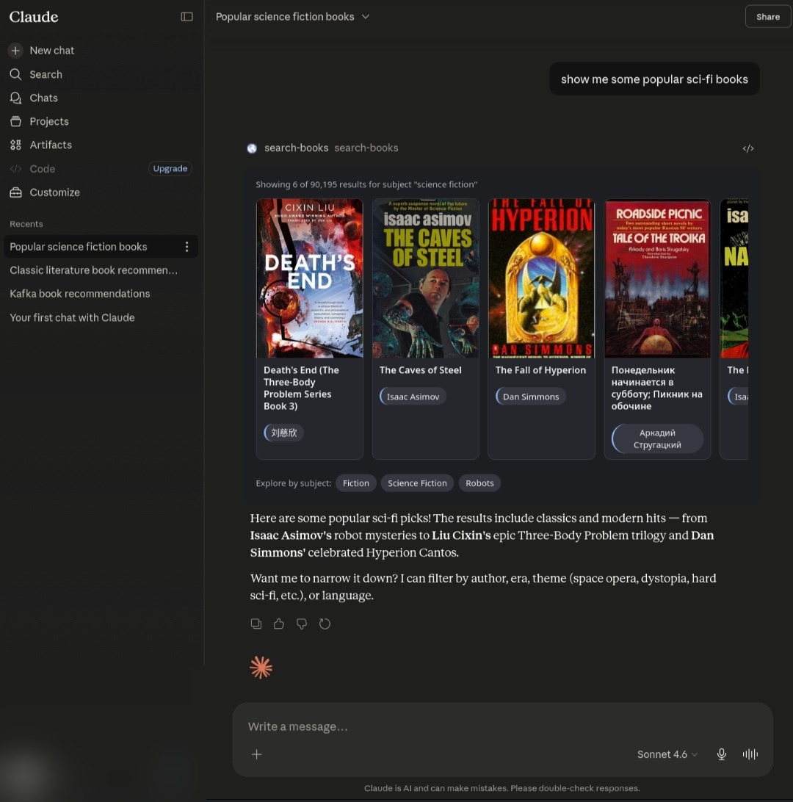

# open-library-mcp-app

A generative UI example built with [Spring AI](https://spring.io/projects/spring-ai) and [MCP Apps](https://modelcontextprotocol.io).

When you ask an MCP-compatible host (such as [Claude](https://claude.ai)) to find books, it calls the `search-books` tool, and the host renders an interactive panel directly inside the conversation — cover images, titles, author chips, and subject drill-downs — without opening a separate application.

## How it works

The server exposes two MCP primitives:

- **`@McpTool` `search-books`** — called by the LLM when the user asks about books. Returns structured results and carries `ui.resourceUri` metadata that tells the host to open the panel.
- **`@McpResource` `ui://books/search-results.html`** — the self-contained HTML panel served to the host. It connects to the host bridge via the `@modelcontextprotocol/ext-apps` SDK, receives the tool result via `ontoolresult`, and renders cards directly.

After each render the panel posts its active filters back into the model context (`updateModelContext`), so the model can refine the search across turns without losing state. Chip clicks send a message back into the conversation; the model reads the context and calls `search-books` again with the updated filters.

The LLM and all inference run inside the host. The server only needs to provide tools and resources.


## Stack

| | |
|---|---|
| Java | 24 |
| Spring Boot | 4.0.6 |
| Spring AI | 2.0.0-M7 (`spring-ai-starter-mcp-server-webmvc`) |
| MCP transport | Streamable HTTP |
| ext-apps SDK | `@modelcontextprotocol/ext-apps` 1.7.2 |
| Data source | [Open Library API](https://openlibrary.org/developers/api) (free, no key) |
| Tunnel | [Cloudflare Quick Tunnels](https://developers.cloudflare.com/cloudflare-one/connections/connect-networks/do-more-with-tunnels/trycloudflare/) |


## Prerequisites

- JDK 24+
- [`cloudflared`](https://github.com/cloudflare/cloudflared) on your PATH
- An MCP App-compatible host: [Claude](https://claude.ai) or any client that supports the `ui.resourceUri` extension


## Running locally

```bash
./scripts/dev.sh
```

This boots the Spring Boot server on port 3001 and opens a Cloudflare quick tunnel. When ready it prints:

```
────────────────────────────────────────────────────────────────
  Public MCP endpoint:
      https://your-tunnel.trycloudflare.com/mcp

  Add as a Custom Connector:
      https://claude.ai/  →  Settings  →  Connectors  →  Add custom connector
      Paste the URL above.
────────────────────────────────────────────────────────────────
```

Paste the URL into the connector dialog, then ask: **"find me books about artificial intelligence"**.

> Quick tunnel URLs are ephemeral — they change on every restart. For a stable URL use a named Cloudflare tunnel tied to an account.

<p align="center">
  
</p>


## Running tests

```bash
./gradlew test
```


## Project structure

```
src/main/java/dev/eleiton/openlibrary/
├── mcp/
│   └── BookSearchApp.java          # @McpTool and @McpResource definitions
├── client/
│   └── OpenLibraryClient.java      # REST client for openlibrary.org/search.json
└── model/
    ├── SearchCriteria.java
    ├── SearchResponse.java
    └── BookResults.java

src/main/resources/
├── app/
│   └── search-results.html         # Self-contained MCP App panel (HTML + CSS + JS)
└── application.properties
```


## Notes

- Spring AI 2.0.0-M7 is a milestone release. The `@McpTool`, `@McpResource`, and `MetaProvider` APIs may change before GA.
- The `search-books` tool description is load-bearing: it instructs the model when to call the tool, how to map user intent to parameters, and how to handle conversational refinement. Changes to it affect model behaviour directly.
- The panel registers `ontoolresult` before calling `app.connect()` to avoid missing the initial push from the host.
